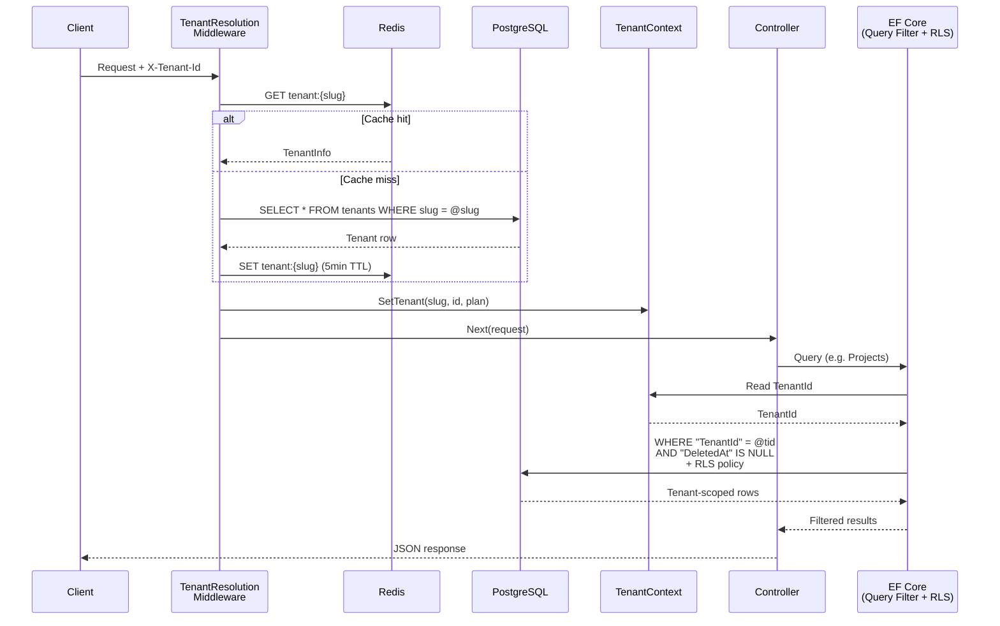

# TenantFlow

> A multi‑tenant SaaS platform built with .NET 10, clean architecture, and a
> focus on real‑world production patterns. No magic frameworks, just plain
> C# services, EF Core, PostgreSQL, and Redis.


---

## Why TenantFlow?

TenantFlow is a **starter kit** for anyone building a multi‑tenant SaaS
product. It handles the hard parts so you don’t have to:

- **Tenant resolution** via header (`X-Tenant-Id`) and Redis caching
- **Row‑level security** at the database level (PostgreSQL RLS)
- **Global query filters** so you never accidentally leak data between tenants
- **JWT auth** with RSA‑signed tokens, refresh tokens (httpOnly cookies), and
  role‑based and resource‑based authorization
- **Soft deletes** and full audit trails on every domain entity

It’s deliberately lightweight: no MediatR, no AutoMapper, no FluentValidation.
If you know C# and EF Core, you’ll feel right at home.

---

## Quick Start

### 1. Prerequisites

- [.NET 10 SDK](https://dotnet.microsoft.com/download/dotnet/10.0)
- [Docker](https://www.docker.com/)

### 2. Clone and start the infrastructure

```bash
git clone https://github.com/Md-Hasib-Askari/TenantFlow.git && cd TenantFlow
docker compose -f docker/docker-compose.yml up -d
```

This gives you PostgreSQL, Redis, and pgAdmin running locally.

### 3. Run the API (seed the database on first run)

```bash
dotnet run --project src/Api -- --seed
```

The API is now at `http://localhost:5204`. A demo tenant (`acme`) and admin
user (`admin@mtsp.dev` / `Admin123!`) are created automatically.

### 4. Make your first request

```bash
# Login
curl -X POST http://localhost:5204/api/auth/login \
  -H "Content-Type: application/json" \
  -d '{"email":"admin@mtsp.dev","password":"Admin123!"}'

# Grab the access token and tenant ID, then fetch projects
curl http://localhost:5204/api/projects \
  -H "Authorization: Bearer <token>" \
  -H "X-Tenant-Id: <tenant-id>"
```

That’s it! You’re up and running.

---

## What’s inside?

### Entities & Domain

- **Tenant:** slug, name, plan tier, status, custom settings (JSON column)
- **ApplicationUser:** email/username/password, primary tenant, status
- **UserTenantRole:** links a user to a tenant with a role (Owner/Admin/Member/Viewer)
- **Project & ProjectMember:** tenant‑scoped projects with member roles (Member/Editor/Admin)
- **TaskItem:** tasks within a project, with assignee, reporter, priority, status, due date, etc.
- **ApiKey:** per‑tenant API keys for programmatic access
- **RefreshToken:** hashed refresh tokens tied to users
- **Invitation:** email invites for tenant membership

All entities that belong to a tenant implement `ITenantScoped`, and the
`AppDbContext` applies a **global query filter** so you never need to write
`.Where(t => t.TenantId == ...)` manually.

### Multi‑Tenancy Flow



1. Every request must include an `X-Tenant-Id` header (except auth endpoints
   and tenant creation).
2. `TenantResolutionMiddleware` checks Redis first, falls back to Postgres.
3. The resolved tenant is stored in scoped `TenantContext`.
4. EF Core’s query filter and the PostgreSQL RLS interceptor keep data isolated.

### Auth & Authorization

- **JWT** signed with RSA (2048‑bit). The private key can be a PEM string in
  configuration.
- **Refresh tokens** stored as hashed values in the DB, delivered via
  httpOnly, Secure, SameSite=Lax cookies.
- **Policies & handlers** for tenant‑level roles, tenant membership,
  project‑level membership, and task update permissions (assignee or
  project editor/admin).

### Caching

Redis is used to cache tenant lookups (`tenant:{slug}` and `tenant:id:{id}`)
with a 5‑minute TTL, drastically reducing DB round‑trips on every request.

### Soft Deletes & Auditing

Entities that implement `IDeleteAudit` are automatically filtered out of all
queries when `DeletedAt` is set. Full create/update/delete audit fields are
populated via `BaseAudit` and the FK relationships to `ApplicationUser`.

---

## Project Layout

```
src/
├── Api/                          # ASP.NET Core host (composition root)
│   ├── Authorization/            #   Policy requirements & handlers
│   ├── Controllers/              #   Auth, Project, Task, Tenant, User
│   ├── Extensions/               #   ClaimsPrincipal helpers
│   ├── HttpRequests/             #   REST client (.http) files
│   ├── Middleware/                #   Exception handling, tenant resolution
│   └── Program.cs                #   DI composition, middleware pipeline
├── Application/                  # Business logic layer
│   ├── Auth/                     #   Auth DTOs, service & repo interfaces
│   ├── Common/                   #   Shared attributes & interfaces
│   ├── Projects/                 #   DTOs / interfaces / services
│   ├── Tasks/                    #   DTOs / interfaces / services
│   ├── Tenants/                  #   DTOs / interfaces / services
│   └── Users/                    #   DTOs / interfaces / services
├── Domain/                       # Zero-dependency core
│   ├── Entities/                 #   Tenant, ApplicationUser, Project, TaskItem …
│   │   ├── Common/               #     BaseAudit, ICreateAudit, IUpdateAudit, IDeleteAudit
│   │   ├── Projects/             #     Project, ProjectMember
│   │   └── Tasks/                #     TaskItem
│   ├── Enums/                    #   PlanTier, TenantStatus, UserStatus …
│   ├── Exceptions/               #   Domain exception types
│   └── Interfaces/               #   ITenantScoped, ITenantContext
└── Infrastructure/               # Data access & external services
    ├── Identity/                 #   AuthService, JwtTokenService, ApiKeyService
    ├── Migrations/               #   EF Core migrations
    ├── Persistence/              #   AppDbContext, entity configs, interceptors
    │   └── Configurations/       #     IEntityTypeConfiguration<T> for each entity
    ├── Projects/                 #   Project & ProjectMember repositories
    ├── Seed/                     #   DataSeeder
    ├── Tasks/                    #   TaskRepository
    ├── Tenants/                  #   TenantRepository, TenantContext, RedisCacheService
    └── Users/                    #   UserRepository

tests/
├── IntegrationTests/           # Testcontainers-based integration tests
├── Api.UnitTests/              # Unit tests for controllers & middleware
├── Application.UnitTests/      # Unit tests for service layer
└── Infrastructure.UnitTests/   # Unit tests for repositories & EF config
```

---

## Running Tests

```bash
dotnet test                          # all projects
dotnet test tests/IntegrationTests   # only integration tests
```

Integration tests spin up a fresh Postgres container per test class — no
external setup needed.

---

## Helper Scripts

| Script | Usage | Description |
|---|---|---|
| `docker-up.sh` | `./scripts/docker-up.sh [docker args…]` | Start Postgres, Redis, pgAdmin containers |
| `run.sh` | `./scripts/run.sh [--seed] [--no-watch]` | Run API (hot reload by default). `--seed` seeds the DB first, `--no-watch` disables hot reload |
| `seed.sh` | `./scripts/seed.sh [extra args…]` | Run API with `--seed` flag to populate the database |
| `migrate.sh` | `./scripts/migrate.sh add <name>` | Create migration |
| `migrate.sh` | `./scripts/migrate.sh remove` | Undo last migration |
| `migrate.sh` | `./scripts/migrate.sh apply [name]` | Apply up to `name` (default: latest) |
| `migrate.sh` | `./scripts/migrate.sh revert [name]` | Roll back to `name` (default: empty) |
| `migrate.sh` | `./scripts/migrate.sh list` | List all migrations |
| `migrate.sh` | `CONNECTION=<conn-string> ./scripts/migrate.sh …` | Override connection string |

---

## Conventions (for contributors)

- **No framework magic:** plain services and repositories. Readable,
  predictable code.
- **Enums stored as strings:** `PlanTier`, `TenantStatus`, etc.
- **PATCH endpoints** use `[AtLeastOneRequired]` to enforce at least one field
  is provided.
- **Nullable reference types** and **implicit usings** are enabled everywhere.

---

## Contribute

TenantFlow is open-source. Pick an area, open a PR, and tag `@Md-Hasib-Askari` for review.

| Area | What's involved |
|---|---|
| **Billing** | Integrate Stripe for plan upgrades, invoicing, and usage-based billing |
| **Webhooks** | Outgoing webhooks for tenant events (project created, task updated, member joined) |
| **Rate limiting** | Per-tenant and per-user rate limiting via Redis sliding window |
| **Audit log** | Immutable log of all state-changing operations per tenant |
| **File uploads** | Tenant-scoped file storage (S3 / Azure Blob), with signed per-user download URLs |
| **Email** | SendGrid / SMTP integration for invitations, task assignments, password resets |
| **Search** | Full-text search across tasks and projects using PostgreSQL `tsvector` |
| **API versioning** | URL or header-based versioning for the public API surface |
| **GraphQL** | HotChocolate or similar alongside REST for flexible client queries |
| **Metrics** | Per-tenant usage stats, request counts, storage used |

---

## License

GNU General Public License v3.0
